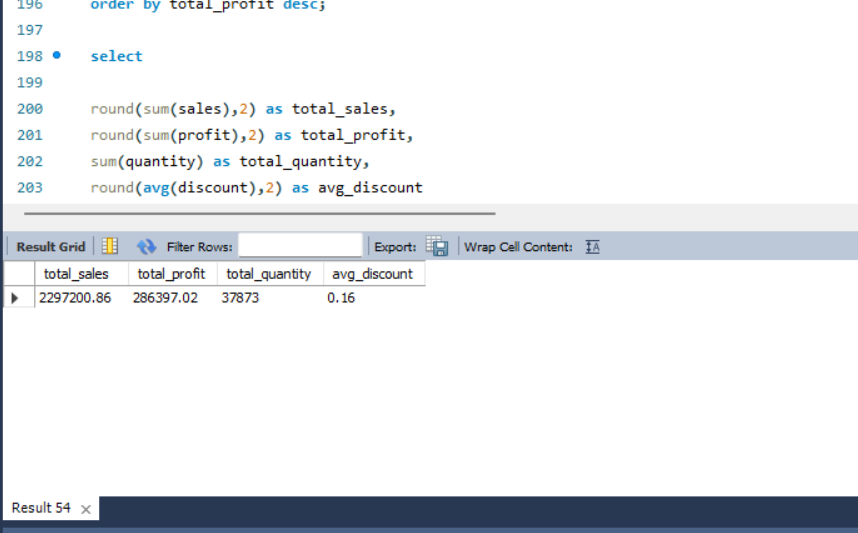

# 🛒 Retail Sales Analysis — Superstore Dataset

**A complete end-to-end SQL data analysis project on 10,000+ retail transactions.**

> Author: Abhishek Mishra | Tool: MySQL + Power BI | Dataset: Superstore (9,994 records)

---

## 📊 Project Overview

This project analyzes a retail superstore dataset using SQL to uncover business insights around sales performance, profitability, regional trends, and product-level analysis. It covers data cleaning, exploratory analysis, and advanced SQL techniques like window functions and CTEs. Results are visualized using Power BI.

---

## 🗂️ Files in This Repository

| File | Description |
|------|-------------|
| `superstore.csv` | Raw dataset with 9,994 retail transaction records |
| `retail_sales_analysis.sql` | All SQL queries — cleaning, EDA, and advanced analysis |
| `business_insights.txt` | Key findings and business recommendations |

---

## 📸 Power BI Dashboard

### 🖥️ Superstore Performance Dashboard

### 🏆 Top Products by Sales & Sales by Customer Segment

### 🗺️ Top States by Sales

---

## 🔢 Key Metrics (From Analysis)

| Metric | Value |
|--------|-------|
| Total Sales | $2,297,200.86 |
| Total Profit | $286,397.02 |
| Profit Margin | 12.47% |
| Total Orders | 9,994 |
| Units Sold | 37,873 |
| Avg Discount | 15.6% |

---

## 🧹 Data Cleaning

- Checked for NULL values in key columns (Sales, Profit, Quantity, Category)
- Identified **17 duplicate rows** in the dataset
- Verified data types and ranges (Sales range: $0.44 → $22,638)

---

## 📈 SQL Query Outputs

### 📊 Final KPIs

### 🏅 Products with Higher Sales than Average

### 🗺️ Region Wise Top Sales

### 📍 State Wise Profit

### 🚚 Shipping Mode Analysis

---

## 📈 Analysis Highlights

### 🏆 Top Performing States (by Sales)
1. California — ~$457K
2. New York — ~$310K
3. Texas — ~$170K

### 📦 Top Products (by Sales)
- Phones and Chairs lead with ~$330K each
- Storage, Tables, and Binders follow

### 🗺️ Sales by Region
| Region | Total Sales |
|--------|-------------|
| West | ~$725K |
| East | ~$678K |
| Central | ~$501K |
| South | ~$391K |

### 📂 Category Performance
| Category | Profit |
|----------|--------|
| Technology | Highest |
| Office Supplies | Medium |
| Furniture | Lowest (near breakeven) |

### ⚠️ Loss-Making Products
| Product | Total Loss |
|---------|-----------|
| Tables | -$17,725 |
| Bookcases | -$3,473 |
| Supplies | -$1,189 |

---

## 🛠️ SQL Techniques Used

- **Data Cleaning** — NULL checks, duplicate detection
- **Aggregations** — SUM, AVG, COUNT with GROUP BY
- **Window Functions** — RANK(), DENSE_RANK(), ROW_NUMBER()
- **CTEs** — Common Table Expressions for multi-level queries
- **Subqueries** — Filtering products above average sales
- **CASE Statements** — Profit vs Loss classification

---

## 💡 Business Insights

1. **Technology** is the most profitable category — prioritize stock and marketing here.
2. **Tables and Bookcases** are consistently loss-making — review pricing or discontinue.
3. **California and New York** together account for ~33% of total revenue — high-value markets.
4. **Central region** has low profit despite decent sales — discount strategy needs revision.
5. **Consumer segment** drives 50.5% of sales — key target audience.

---

## 🚀 How to Run

1. Import `superstore.csv` into MySQL
2. Create database: `CREATE DATABASE retail_project;`
3. Run queries from `retail_sales_analysis.sql` in order

---

## 📬 Connect

- GitHub: [abhi003shek](https://github.com/abhi003shek)
